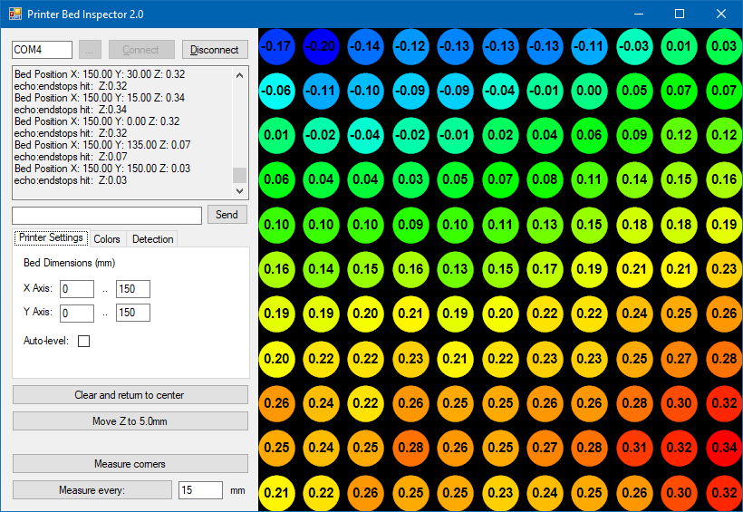

# Printer Bed Inspector

A Windows utility for 3D printers equipped with automatic levelers.  It tests multiple points to evaluate bed flatness.

While troubleshooting prints that always peeled up in a particular spot, I spot-checked a few positions (with the "G30" g-code) and discovered the surface of the bed was a [lot less linear](https://www.youtube.com/watch?v=IJRdOCfPtm8) than I'd expected.  I wanted a clearer picture, so I created this utility.  The variation between the highest peak and lowest valley was a quarter of a millimeter.  That doesn't sound like much, but it's more than two print layers at 0.1mm layer height!

## Instructions

1. Type in your printer's serial port address at the top left and click Connect. (If it's the only serial device connected, the address should be auto-detected.)
2. Your printer should automatically home, center, and measure the height. (G28 and G30)
3. Click around in the field to measure that location. (G1 followed by G30)
4. To measure many points automatically, click the "Measure every" button at the bottom-left.  (Change the number in the box first if you'd like to adjust the spacing.)

## Compatibility

Out of the box: probably most/all printers with English **Marlin 1.x or 2.x** firmware.

If text is appearing in the sidebar but you don't see any colored circles, try enabling the *Custom* option on the *Detection* tab and then fill in the pattern from the text on the sidebar.

#### Custom detector example (from an MKS Gen L board with a Czech-language firmware)

After clicking a location in the black area, the printer moves, takes a Z-probe measurement and writes the following to the sidebar area:

	Zpracování Ložní X: 116.00 Y: 117.00 Z: -0.00

Go to the *Detection* tab, enable the *Custom* pattern, enter that text and just replace the numbers with `{X}`, `{Y}`, and `{Z}` like this:

	Zpracování Ložní X: {X} Y: {Y} Z: {Z}

Now, clicking a location in the black area should produce a colored circle!  